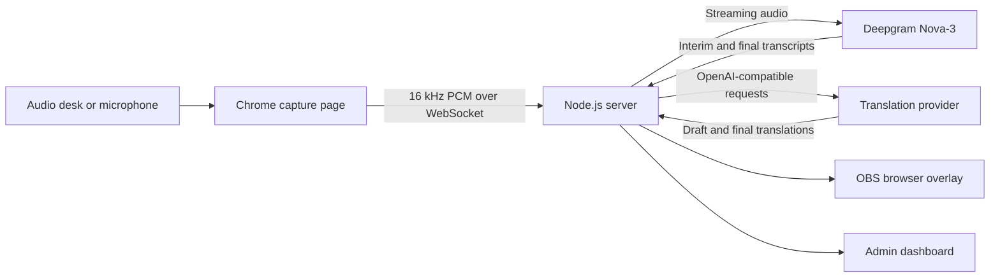

# PGConf Live Captions

Self-hosted, real-time bilingual captions for conference rooms and live streams.
Audio is captured in Chrome, transcribed by Deepgram, translated by any
OpenAI-compatible provider, and rendered in an OBS-ready browser overlay.

The project was built for PostgreSQL community conferences, but the runtime is
generic: change the room list and vocabulary files to use it at any event.

> Status: production-oriented single-server deployment. The operator interface
> is currently in Brazilian Portuguese, and caption directions are English to
> Portuguese or Portuguese to English.

## What it provides

- Low-latency streaming speech recognition with Deepgram Nova-3
- English to Portuguese and Portuguese to English translation
- Live draft captions that improve as the speaker continues
- Stable caption prefixes to reduce distracting on-screen rewrites
- Transparent 1920x1080 OBS Browser Source overlay
- Multiple isolated rooms in one server process
- Per-room bearer tokens and a password-protected admin dashboard
- Transcript download, room status, and session reset controls
- OpenAI-compatible primary, final, and fallback translation providers
- PostgreSQL-aware keyterms, transcription aliases, and translation glossary
- Docker Compose deployment with automatic HTTPS from Caddy

## How it works



One Node.js process serves the capture, overlay, and admin pages and keeps room
state in memory. Caddy terminates TLS and proxies HTTP and WebSocket traffic to
the app. No database is required.

## Requirements

### Service accounts

- A [Deepgram](https://deepgram.com/) API key for speech recognition
- An API key for [OpenAI](https://platform.openai.com/) or another provider
  with an OpenAI-compatible `/chat/completions` streaming API

### Production server

- A Linux VPS with a public IPv4 or IPv6 address
- Docker Engine with the Docker Compose v2 plugin
- A domain or subdomain whose DNS record points to the VPS
- Inbound TCP ports 80 and 443, and UDP port 443, allowed by the firewall
- Bash, `git`, `openssl`, and `curl`

The app itself is lightweight. Translation provider quotas and network latency
usually matter more than additional VPS CPU.

### Event computers

- A recent Chrome or Chromium browser for each active capture room
- Access to the room's microphone or audio-desk mix
- OBS Studio for the display or live stream
- A reliable network path to the VPS

Microphone capture requires HTTPS outside `localhost`. The production stack
handles certificates automatically after DNS is configured.

## Quick start: production VPS

### 1. Prepare DNS and firewall

Create an `A` record (and optionally `AAAA`) such as:

```text
captions.example.com -> 203.0.113.10
```

Allow inbound ports 80/tcp, 443/tcp, and 443/udp. Caddy needs ports 80 and 443
to obtain and renew the TLS certificate.

### 2. Clone and configure

```bash
git clone https://github.com/joaofoltran/pgconf-livecaptions.git
cd pgconf-livecaptions
cp .env.example .env
chmod 600 .env
```

Edit `.env` and set only the deployment hostname and service credentials:

```dotenv
DOMAIN=captions.example.com
DEEPGRAM_API_KEY=your-deepgram-key
OPENAI_API_KEY=your-translation-provider-key
```

You may also change `ROOMS`, models, providers, and caption cadence. Leave
`ADMIN_PASSWORD`, `SESSION_SECRET`, and room token fields empty if you want the
deploy script to generate strong values.

### 3. Deploy

```bash
./deploy.sh
```

The script checks the host, validates `.env`, generates missing local secrets,
builds the containers, waits for the app health check, and prints the capture
and overlay URLs.

Run the same command after pulling an update:

```bash
git pull --ff-only
./deploy.sh
```

See [Configuration](docs/CONFIGURATION.md) for every setting and
[Operations](docs/OPERATIONS.md) for deployment, rehearsal, monitoring,
upgrades, and recovery.

## Local development

Node.js 22.19 or newer is required.

```bash
git clone https://github.com/joaofoltran/pgconf-livecaptions.git
cd pgconf-livecaptions
cp .env.example .env
npm ci
```

For local development, replace the placeholder secrets in `.env`, including one
room token:

```dotenv
DOMAIN=localhost
ADMIN_PASSWORD=use-a-long-local-password
SESSION_SECRET=use-an-independent-secret-at-least-32-characters
DEEPGRAM_API_KEY=your-deepgram-key
OPENAI_API_KEY=your-provider-key
ROOMS=room-1
TOKEN_ROOM_1=use-a-long-random-room-token
```

Start the app:

```bash
npm run dev
```

Then open:

```text
http://localhost:3000/r/room-1?k=use-a-long-random-room-token
```

`localhost` is considered a secure browser context, so microphone permission
works without local TLS.

Useful commands:

```bash
npm run dev        # watch and restart the TypeScript server
npm run typecheck  # check TypeScript without emitting files
npm test           # run local unit tests
npm run build      # compile to dist/
npm start          # run the compiled production entry point
```

## Configure rooms

Rooms are comma-separated slugs. Every slug maps to an environment variable
named `TOKEN_<UPPERCASE_SLUG>`, with punctuation converted to underscores.

```dotenv
ROOMS=main-stage,workshop-1
TOKEN_MAIN_STAGE=a-long-random-secret
TOKEN_WORKSHOP_1=another-long-random-secret
```

The deploy script creates missing room tokens. Room slugs must be lowercase
letters, numbers, and hyphens.

Each room has two private URLs:

```text
Capture: https://captions.example.com/r/main-stage?k=ROOM_TOKEN
Overlay: https://captions.example.com/r/main-stage/overlay?k=ROOM_TOKEN
```

Treat both URLs as bearer credentials. Anyone with a room URL can connect to
that room. Do not post them publicly or include them in screenshots and logs.

## Run a room

1. Open the room's capture URL in Chrome.
2. Allow microphone access.
3. Select the microphone or audio-desk input.
4. Select English to Portuguese or Portuguese to English.
5. Click **Iniciar**.
6. Confirm that microphone, Deepgram, server, and overlay statuses are healthy.
7. Copy the overlay URL into OBS.

Only one capture client can own a room at a time. A new capture connection
replaces the previous one. Multiple overlays may watch the same room.

For a multi-room event, use one capture computer per room. During a one-machine
rehearsal, keep every capture page in a visible Chrome window because browsers
may throttle background tabs.

## Add the overlay to OBS

Create an OBS **Browser Source** with:

- URL: the room's overlay URL
- Width: `1920`
- Height: `1080`
- Custom CSS: none required
- Background: transparent

The last completed caption stays above the phrase currently being translated.
Captions disappear after inactivity. OBS does not capture the microphone; only
the Chrome capture page does.

After deploying frontend changes, hard-refresh capture pages and use
**Refresh cache of current page** on each OBS Browser Source.

## Customize conference vocabulary

The files under [`config/`](config/) are read when the app starts:

- [`keyterms.txt`](config/keyterms.txt): terms reinforced in Deepgram and
  preserved during translation
- [`aliases.txt`](config/aliases.txt): common STT mistakes mapped to canonical
  spellings
- [`glossary.txt`](config/glossary.txt): contextual translation hints

The included files contain PostgreSQL terminology and serve as working
examples. Edit them for your event and restart the app:

```bash
docker compose up -d --force-recreate app
```

## Translation providers

The primary provider is configured through `OPENAI_*`. Despite that prefix,
these variables accept any OpenAI-compatible service; `OPENAI_API_KEY` contains
the primary provider's key, not necessarily an OpenAI key.

### Production-tested setup: Cerebras primary, OpenAI fallback

The original conference deployment used Cerebras `gpt-oss-120b` for normal
draft and final translation, with OpenAI `gpt-4.1-mini` used only when Cerebras
timed out or failed:

```dotenv
OPENAI_BASE_URL=https://api.cerebras.ai/v1
OPENAI_API_KEY=your-cerebras-key
OPENAI_MODEL=gpt-oss-120b
OPENAI_EXTRA_BODY='{"reasoning_effort":"low"}'
OPENAI_SERVICE_TIER=

FALLBACK_BASE_URL=https://api.openai.com/v1
FALLBACK_API_KEY=your-openai-key
FALLBACK_MODEL=gpt-4.1-mini
FALLBACK_EXTRA_BODY=
```

We chose this arrangement because OpenAI was the latency bottleneck in our
September 2026 tests from a Sao Paulo VPS. On noisy real-event transcripts,
Cerebras `gpt-oss-120b` produced similarly faithful translations in roughly
305 ms versus 751 ms for OpenAI `gpt-4.1-mini`. OpenAI remained valuable as a
fallback: it was slower, but prevented a Cerebras stall from dropping the final
caption entirely.

These numbers are historical measurements, not a promise of current provider
performance. Test both quality and latency from your venue and accounts.

### Other provider configurations

To use OpenAI as the primary provider:

```dotenv
OPENAI_BASE_URL=https://api.openai.com/v1
OPENAI_API_KEY=your-openai-key
OPENAI_MODEL=gpt-4.1-mini
```

Optional `FINAL_*` settings can send finalized phrases to a separate provider.
Optional `FALLBACK_*` settings protect final captions when the primary provider
times out or fails. Provider-specific request fields can be supplied as JSON
through `*_EXTRA_BODY`.

Compatibility is not guaranteed merely because a provider accepts
OpenAI-shaped requests: this app depends on streamed chat completion chunks,
low first-token latency, and faithful translation of noisy speech transcripts.
Test with recordings from the real event.

See [Configuration](docs/CONFIGURATION.md#translation-providers) for examples.

## Admin dashboard

Open:

```text
https://captions.example.com/admin
```

The dashboard shows capture and overlay connections, translation direction,
the latest caption, and transcript size. It can:

- open capture and overlay pages
- download a transcript as text
- clear the in-memory room session
- show whether each room is actively capturing

Transcripts and current captions are held in memory. Restarting the app or
recreating its container clears them. Download anything you need before an
upgrade.

## Cost and capacity

Costs come from Deepgram audio minutes and translation requests/tokens. Live
drafts can generate several translation requests per second per active room.

Tune these settings to match provider quotas:

```dotenv
LIVE_DRAFTS=true
DRAFT_INTERVAL_MS=350
DRAFTS_PER_SECOND=15
DG_ENDPOINTING=300
```

`DRAFTS_PER_SECOND` is shared by all rooms. Start conservatively, inspect
provider rate-limit dashboards, and rehearse all expected rooms at the same
time. Disabling live drafts greatly reduces translation requests, but captions
update only after Deepgram finalizes a phrase.

## Security notes

- `.env`, `.env.test`, TLS data, and generated audio are ignored by Git.
- The Deepgram master key remains on the server. In browser-STT mode, the
  browser receives a short-lived Deepgram grant token.
- Admin cookies are HTTP-only, same-site, and secure in production.
- Admin sessions use a separate generated signing secret and expire after 24
  hours.
- Room URLs contain bearer tokens. Rotate a room token in `.env` and recreate
  the app if a URL is exposed.
- The admin password and room tokens should be unique and at least 16
  characters. `deploy.sh` generates longer random values by default.
- Do not commit provider keys. Before making a fork public, inspect its complete
  Git history, not only the current files.

This project does not provide user accounts, persistent audit logs, horizontal
scaling, or a multi-tenant security boundary.

## Diagnostics and troubleshooting

Check service state and logs:

```bash
docker compose ps
docker compose logs --tail 100 app
curl -fsS https://captions.example.com/health
```

Copy `.env.test.example` to `.env.test` to save private diagnostic URLs. Then:

```bash
node scripts/rooms-status.mjs
./scripts/make-test-audio.sh
node scripts/latency-test.mjs \
  --file test-audio/en.wav \
  --direction en-pt
```

The audio generator uses macOS `say` and `afconvert`; the latency and status
scripts run anywhere supported by Node.js.

For symptoms and recovery procedures, see
[Operations: troubleshooting](docs/OPERATIONS.md#troubleshooting).

## Known limitations

- Caption directions are currently limited to English and Portuguese.
- Application state and transcripts are in memory only.
- A room accepts one capture client at a time.
- A single app process owns all rooms; horizontal replicas would not share
  room state.
- The capture and admin user interfaces are currently Brazilian Portuguese.
- Translation quality and latency depend on third-party APIs and real-world
  audio quality.

## Contributing

Issues and pull requests are welcome. Before submitting a change:

```bash
npm ci
npm run typecheck
npm test
npm run build
```

Do not include real room URLs, transcripts, API keys, or attendee information
in issues or test fixtures.

## License

[MIT](LICENSE)
