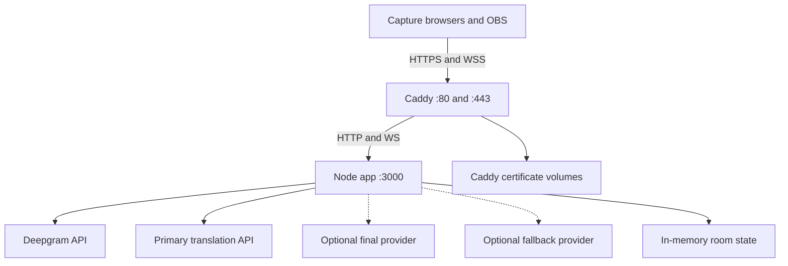

# Operations Guide

This guide covers a single-host production deployment with Docker Compose and
Caddy. Read the main [README](../README.md) first and keep
[Configuration](CONFIGURATION.md) nearby during setup.

## Production topology



Only Caddy is published to the host network. The app is reachable through the
internal Compose network. Caddy stores certificates in named Docker volumes;
room state and transcripts are not persisted.

## First deployment

### 1. Provision the host

Use a maintained Linux distribution and install:

- Docker Engine
- Docker Compose v2 plugin
- Bash
- Git
- OpenSSL
- curl
- A DNS lookup tool such as `dig`

Follow the official Docker installation instructions for your distribution.
Confirm:

```bash
docker --version
docker compose version
git --version
openssl version
curl --version
```

Run deployments from a non-shared account with permission to use Docker. Access
to the Docker socket is effectively root access.

### 2. Configure networking

Point the chosen hostname to the host:

```text
captions.example.com -> VPS public IP
```

Allow:

- `80/tcp` for certificate issuance and HTTP-to-HTTPS redirect
- `443/tcp` for HTTPS and WebSockets
- `443/udp` for HTTP/3 when available

Do not publish port 3000 from the Compose file.

Check DNS before requesting a certificate:

```bash
dig +short captions.example.com
```

### 3. Clone and create `.env`

```bash
git clone https://github.com/joaofoltran/pgconf-livecaptions.git
cd pgconf-livecaptions
cp .env.example .env
chmod 600 .env
```

Set `DOMAIN`, `DEEPGRAM_API_KEY`, and `OPENAI_API_KEY`. Configure rooms and
provider choices if the defaults are not appropriate.

### 4. Start the stack

```bash
./deploy.sh
```

On first run, the script:

1. checks required host commands;
2. generates an admin password, session secret, and missing room tokens;
3. validates the deployment configuration;
4. builds the app image;
5. starts the app and Caddy;
6. waits for the app and proxy containers;
7. checks the public HTTPS health endpoint when `curl` is available;
8. prints private capture and overlay links.

If `.env` does not exist, the script creates it and reports the values that
still need to be configured. Edit the file and run it again.

### 5. Verify externally

```bash
docker compose ps
docker compose logs --tail 100 app
docker compose logs --tail 100 caddy
curl -fsS https://captions.example.com/health
```

The health response should resemble:

```json
{"ok":true,"rooms":4}
```

Open one capture URL, permit microphone access, start capture, and open its
overlay URL in another browser before configuring OBS.

## Event setup

### Audio

Use the cleanest audio feed available. A direct auxiliary mix from the room
audio desk is usually better than a laptop microphone. Disable operating-system
effects that alter the desk feed where possible.

The capture client requests audio with echo cancellation, noise suppression,
and automatic gain control disabled. Verify levels and clipping at the actual
venue.

### Capture computers

For each active room:

1. use a dedicated computer when possible;
2. connect it to power;
3. disable sleep and automatic OS updates;
4. open only that room's capture URL;
5. select the correct input and translation direction;
6. start capture and confirm all status indicators;
7. keep the Chrome window visible;
8. prevent private room URLs from appearing on the projected display.

A new capture connection replaces an existing capture in the same room. This
is useful for recovery, but opening the same room on a second computer can
silently displace the intended source.

### OBS

Create one Browser Source per room:

| Setting | Value |
| --- | --- |
| URL | Private room overlay URL |
| Width | `1920` |
| Height | `1080` |
| Custom CSS | Empty |
| Shutdown source when not visible | Test before enabling |
| Refresh browser when scene becomes active | Usually disabled |

Keep a scene or preview that makes caption failures visible to the operator.
After a frontend deployment, use **Refresh cache of current page** in OBS.

## Pre-event rehearsal

Run a complete rehearsal with the expected number of simultaneous rooms.

Verify:

- both EN to PT and PT to EN directions;
- every audio input and cable;
- technical vocabulary and speaker names;
- provider rate limits with all rooms active;
- final caption latency after natural pauses;
- OBS font size and safe-area placement on the real display;
- behavior after Wi-Fi or Ethernet interruption;
- behavior after closing and reopening a capture page;
- admin login and transcript download;
- the fallback provider, if configured.

Use actual talk recordings when permitted. Synthetic, perfectly articulated
sentences do not represent recognition errors, accents, room noise, or speaker
hesitation.

## Routine monitoring

### Container status

```bash
docker compose ps
```

The app should report `healthy`; Caddy should report `running`.

### Health endpoint

```bash
curl -fsS https://captions.example.com/health
```

The endpoint verifies the Node process, not third-party provider availability.

### Logs

Follow both services:

```bash
docker compose logs -f --tail 100 app caddy
```

Search recent application warnings:

```bash
docker compose logs --since 15m app | \
  grep -iE "failed|timeout|rate limited|fallback|deepgram|captura caiu"
```

Important patterns include:

- draft or final timeout: provider latency exceeded the app deadline;
- rate limited: lower draft volume or increase provider quota;
- fallback: the final caption moved to the configured backup;
- Deepgram disconnected: speech recognition connection was lost;
- capture disconnected: browser, device, or venue network interruption.

### Room status

On a trusted operator machine:

```bash
cp .env.test.example .env.test
```

Place private capture URLs in `LC_ROOM_URLS`, then run:

```bash
node scripts/rooms-status.mjs
```

The command reports capture state, overlay count, direction, and STT mode. Do
not restart the app while a room reports `CAPTURANDO`.

## Transcripts and state

The server keeps:

- the latest finalized caption;
- the current draft;
- up to 2,000 transcript lines per room;
- connection and translation state.

All of it is in process memory. It is cleared when the app restarts, the
container is recreated, or the room is reset in the admin dashboard.

Download transcripts from `/admin` before:

- deploying an update;
- changing `.env`;
- editing vocabulary and restarting;
- rebooting the host;
- resetting a room.

Transcript files may contain names, speech, and other personal information.
Store and dispose of them according to the event's privacy policy.

## Updates

Choose a quiet period and download needed transcripts first:

```bash
node scripts/rooms-status.mjs
git fetch origin
git pull --ff-only
./deploy.sh
```

Then:

1. check `docker compose ps`;
2. inspect the last 100 app and Caddy log lines;
3. call `/health`;
4. hard-refresh every capture page;
5. refresh the OBS Browser Source cache;
6. perform a short spoken test in both directions.

The `.env` file and Caddy volumes are not replaced by `git pull`.
The example `config/` files are tracked. Keep event-specific vocabulary in a
fork or deployment branch and merge upstream updates there. If you edit a
checkout directly, stash or back up those files before pulling.

### Configuration-only update

```bash
docker compose up -d --force-recreate app
```

### Vocabulary-only update

Vocabulary is mounted from the host but read only at process startup:

```bash
docker compose up -d --force-recreate app
```

### Rollback

Record the previous commit before updating:

```bash
git rev-parse HEAD
```

To run a known-good revision:

```bash
git switch --detach <known-good-commit>
./deploy.sh
```

After the incident, return to `main`:

```bash
git switch main
git pull --ff-only
```

Rolling back the image also restarts the in-memory app and clears transcripts.

## Backing up deployment configuration

The application has no database. Back up:

- `.env` as a secret;
- `config/` vocabulary customizations;
- Caddy volumes only if certificate continuity is important.

Create plaintext backups outside the repository with private permissions:

```bash
backup_dir="$HOME/livecaptions-backups"
install -d -m 700 "$backup_dir"
umask 077
tar -czf "$backup_dir/livecaptions-config-$(date +%Y%m%d-%H%M%S).tar.gz" \
  .env config/
```

The archive contains API keys and bearer tokens. Never upload it to the
repository or an untrusted ticket. Encrypt it before copying it to another
system.

Caddy can obtain new certificates if its volumes are lost, subject to
certificate-authority rate limits.

## Measuring latency

The end-to-end script simulates a capture client in `STT_PROXY=true` mode. Use a
dedicated test room that is not connected to the production OBS scene.

On macOS, create synthetic audio:

```bash
./scripts/make-test-audio.sh
```

Put the dedicated room's private capture URL in `LC_CAPTURE_URL` inside a
mode-600 `.env.test`, then run one test:

```bash
node scripts/latency-test.mjs \
  --file test-audio/en.wav \
  --direction en-pt
```

Compare several runs:

```bash
node scripts/latency-test.mjs \
  --file test-audio/en.wav \
  --direction en-pt \
  --runs 5 \
  --quiet
```

The most useful measurement is end of speech to final caption. Also inspect
first-draft timing, Deepgram connection time, and WebSocket round-trip time.

### Historical benchmark context

The original event deployment was measured from a Sao Paulo VPS in September
2026. It used Cerebras `gpt-oss-120b` with `reasoning_effort: low` as the
primary translator and OpenAI `gpt-4.1-mini` only as the fallback.

In that environment:

- network round-trip to US-hosted APIs was meaningful but not the largest
  component;
- OpenAI first-token latency was usually 500–900 ms and often dominated draft
  responsiveness;
- OpenAI's priority service tier did not produce a measurable latency
  improvement in those tests;
- on noisy real-event transcripts, Cerebras `gpt-oss-120b` was comparably
  faithful and responded in roughly 305 ms, versus 751 ms for OpenAI
  `gpt-4.1-mini`;
- OpenAI remained configured as fallback because a slower recovered final
  caption was preferable to losing the caption when Cerebras stalled;
- Deepgram utterance finalization added delay after speaker silence;
- fast compatible providers varied substantially on noisy real transcripts;
- provider quality measured on clean sample sentences did not predict quality
  on real conference audio.

These are design observations, not current provider benchmarks. Models,
regions, service tiers, quotas, and routing change. Measure from your own venue
and account shortly before the event.

## Incident response

### Captions stop in one room

1. Check the capture page status indicators.
2. Confirm the selected audio input still exists.
3. Check whether another browser replaced the capture connection.
4. Reload the capture page and select the input again.
5. Check `rooms-status.mjs` and app logs.
6. Open the overlay URL directly to isolate OBS cache behavior.

### Captions stop in every room

1. Call `/health`.
2. Run `docker compose ps`.
3. Inspect app logs for provider failures or rate limits.
4. Check provider dashboards and account balance/quota.
5. Check DNS and Caddy logs.
6. If a fallback is configured, confirm its credential and model are valid.
7. Restart only after downloading transcripts and confirming rooms are offline.

### Translation becomes slow

1. Compare WebSocket RTT and end-to-final latency with the latency script.
2. Look for timeout, circuit-breaker, fallback, and rate-limit log entries.
3. Lower `DRAFTS_PER_SECOND`.
4. Increase `DRAFT_INTERVAL_MS`.
5. Temporarily set `LIVE_DRAFTS=false` if final captions remain healthy.
6. Switch provider settings only after a short real-transcript test.

### Suspected room URL exposure

1. Generate a replacement token:

   ```bash
   openssl rand -hex 24
   ```

2. Replace the room's `TOKEN_*` value in `.env`.
3. Recreate the app container.
4. Replace the capture bookmark and OBS URL.
5. Delete screenshots, chat messages, tickets, or logs that contained the old
   URL where possible.

### Suspected provider-key exposure

Revoke and replace the key in the provider dashboard first. Then update `.env`
and recreate the app. Rotating only room tokens does not protect a leaked
Deepgram or translation-provider key.

## Troubleshooting

### Caddy cannot issue a certificate

- Confirm DNS resolves to this host from a public resolver.
- Confirm ports 80 and 443 are not used by another process.
- Confirm the cloud firewall and host firewall allow inbound traffic.
- Ensure `DOMAIN` contains only the hostname.
- Inspect `docker compose logs caddy`.

### Browser cannot use the microphone

- Use Chrome or a current Chromium browser.
- Use HTTPS, except on `localhost`.
- Check site microphone permission and operating-system privacy settings.
- Reconnect the audio device and reload the page.
- Ensure another application is not exclusively holding the device.

### Overlay is blank

- Speak long enough for a draft or final transcript.
- Open the overlay URL in Chrome to separate server issues from OBS issues.
- Confirm the token belongs to the same room.
- Check overlay count in the admin dashboard.
- Refresh the OBS Browser Source cache.

### Deepgram is offline

- Confirm `DEEPGRAM_API_KEY` is current and funded.
- Check outbound HTTPS/WSS connectivity from the VPS.
- Inspect app logs for grant or WebSocket errors.
- If using browser STT, check browser developer tools and venue network policy.

### Provider returns 401 or 404

- Confirm the API key belongs to the configured `BASE_URL`.
- Confirm the model name exists for that account.
- Confirm the base URL ends at the API root, usually `/v1`.
- Do not append `/chat/completions`; the app adds it.

### Provider returns 429

- Lower `DRAFTS_PER_SECOND`.
- Increase `DRAFT_INTERVAL_MS`.
- Confirm requests-per-minute and tokens-per-minute limits.
- Rehearse all rooms concurrently; one-room tests can hide aggregate limits.

### App container is unhealthy

```bash
docker compose ps
docker compose logs --tail 200 app
docker compose config --quiet
```

Configuration validation errors are printed at startup. Correct `.env`, then
run `./deploy.sh` again.
